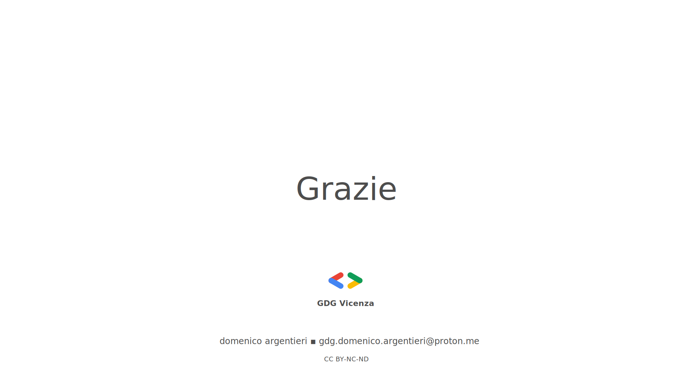

<!--START style -->

<!--END style -->

<!-- INTRO -->
<!-- paginate: false -->

---
<!-- paginate: true -->
<!-- header: '' -->
#
#
#
#
#
#
#
##### Esigenza

---
<!-- header: '**Esigenza** $\color{#ffba3a}{|}$  _Sviluppo sicuro_' -->

#
#
- Nel 2022 ci sono stati in tutto il mondo **2.479**  attacchi informatici;
- Nel 2023 il numero di attacchi è cresciuto del **+12%**;
- Il **56%** deglli attacchi  ha avuto conseguenze di gravità critica o elevata.

---
<!-- paginate: true -->
<!-- header: '' -->
#
#
#
#
#
#
#
##### Contesto

---

<!-- header: '**Contesto** $\color{#ffba3a}{|}$  _DevOps secondo Gartner_' -->
#

---
<!-- header: '**Contesto** $\color{#ffba3a}{|}$  _Toolchain_' -->
#

---
<!-- paginate: true -->
<!-- header: '' -->
#
#
#
#
#
#
#
##### DevSecOps in pratica

---
<!-- header: '**DevSecOps in pratica** $\color{#ffba3a}{|}$  _Architettura_' -->
#

---
<!-- header: '**DevSecOps in pratica** $\color{#ffba3a}{|}$  _Architettura_' -->
#
#
**Sviluppo locale**
- Il developer scrive codice per l'applicativo Accounts.
- Il developer Utilizza [Snyk CLI](https://docs.snyk.io/snyk-cli) per l'analisi SAST/SCA.

**Gestione del codice**
- Il codice è versionato in un bare repository su [GitHub](https://github.com/).
- Una GitHub Action verifica la code coverage nelle pull request.

**Build e rilascio**
- Dopo il merge su main, una [GitHub Action](https://github.com/features/actions) crea la release.
- L'immagine dell'applicativo viene pubblicata su [Docker Hub](https://hub.docker.com/).

---
<!-- header: '**DevSecOps in pratica** $\color{#ffba3a}{|}$  _Architettura_' -->
#
#
**Deploy automatizzato**
- Una GitHub Action esegue il deploy su [Render.com](https://render.com/) via [API](https://api-docs.render.com/reference/create-deploy).
- Render.com avvia un [web service](https://render.com/docs/web-services) basato sull'immagine Docker.

**Gestione dei secret**
- Le credenziali di accesso e altri parametri sensibili sono gestiti con [Render Secrets](https://render.com/docs/configure-environment-variables).
- I secret vengono passati automaticamente all’applicativo durante il deploy.

**Accesso alle API**
- Il client può interagire con le API del web service.

---

<!-- END -->
<!-- header: ''-->
<!-- paginate:  -->
#
